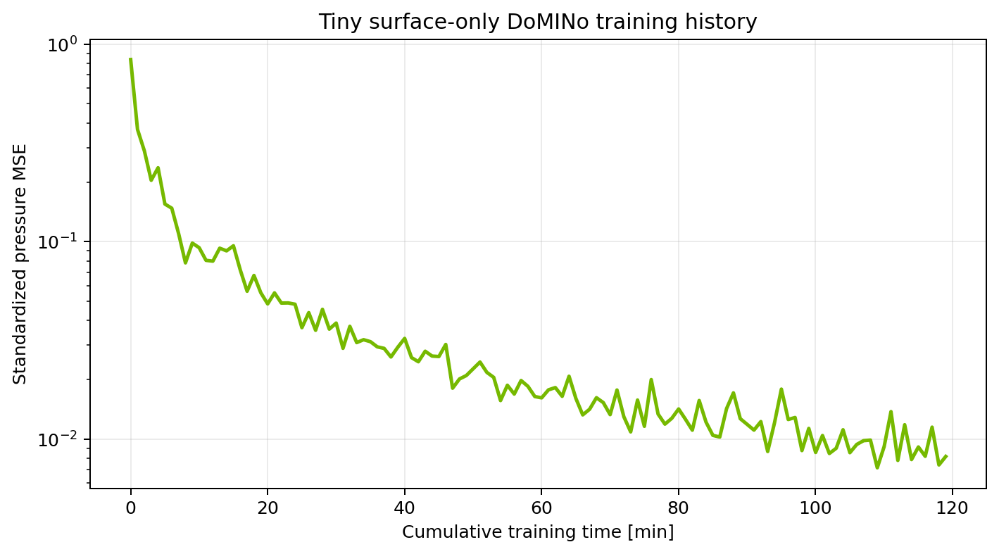
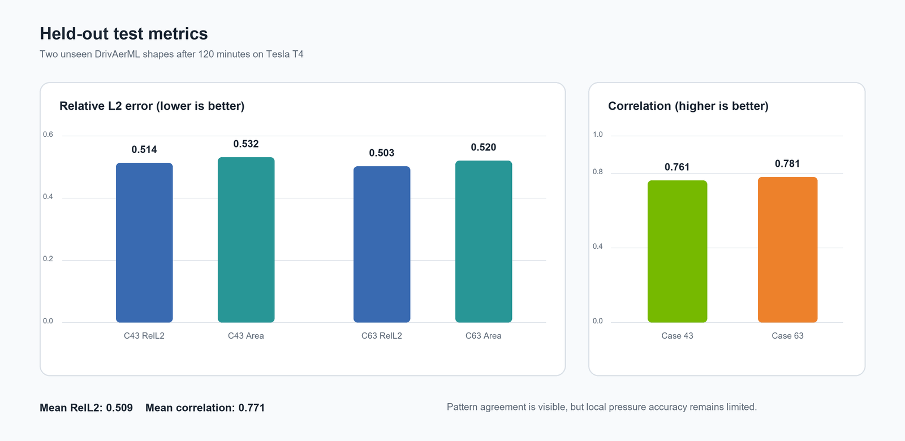
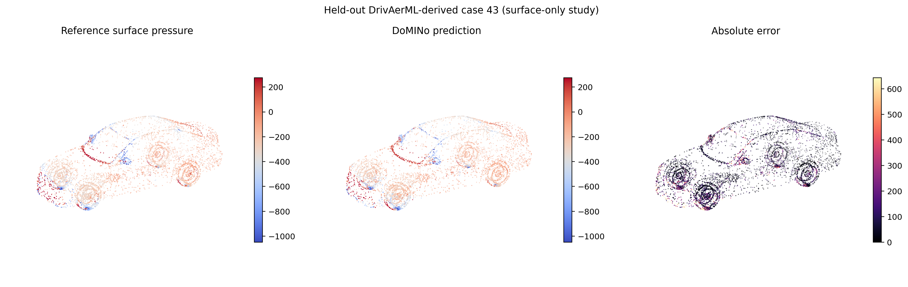
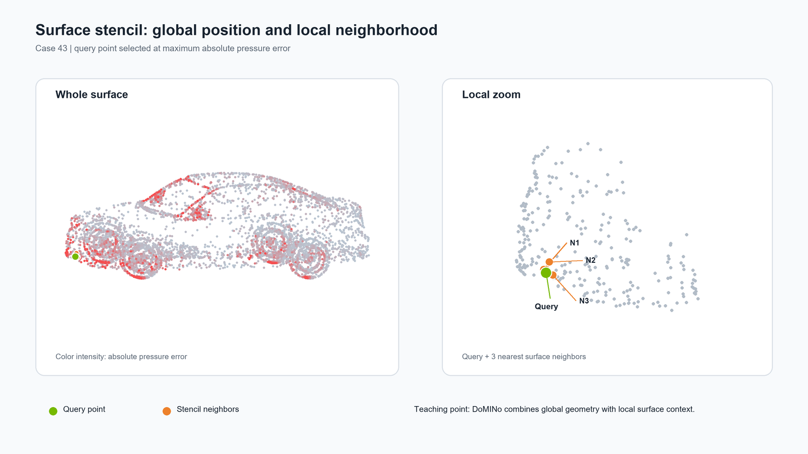

# DoMINo表面圧力予測：120分実行結果

実行日：2026年7月12日  
対象ノートブック：`notebooks/domino_surface_only_colab.ipynb`  
ソース：commit `d89f0a7`

## 結論

PhysicsNeMo 2.1.1の実 `DoMINO` クラスをColabのTesla T4で120分学習し、未学習の2形状に対する表面圧力予測まで完走した。車体全体の高圧・低圧パターンと正解との相関は捉えた一方、車輪・ホイールアーチ・前端・形状境界付近の局所ピークは平滑化された。輪講では「DoMINoが大域形状と局所表面情報をどう組み合わせるか」と「学習損失の低下は未学習形状の精度保証ではない」の2点を中心に扱える。

## 実行条件

| 項目 | 値 |
|---|---:|
| GPU | Tesla T4 |
| PhysicsNeMo | 2.1.1 |
| 実行モード | `full`（Hugging Face由来の表面データ） |
| 学習時間 | 120分 |
| 学習step | 115,454 |
| 学習形状 | 10 |
| 検証形状 | 2 |
| テスト形状 | 2 |
| 表面点数 | 8,192点/形状 |
| 形状点数 | 4,096点/形状 |
| 大域グリッド | 24 × 24 × 24 |
| 表面ステンシル | query点 + 近傍3点 |
| 学習可能パラメータ | 208,545 |
| 混合精度 | AMP有効 |
| 圧力の平均・標準偏差 | -227.916 / 268.856 |

データ分割は次の通り。

- 学習：382, 243, 499, 68, 346, 146, 178, 341, 344, 272
- 検証：481, 417
- テスト：43, 63

## 学習経過

| 経過時間 | train loss |
|---:|---:|
| 1分 | 0.370521 |
| 10分 | 0.093299 |
| 30分 | 0.038741 |
| 60分 | 0.016198 |
| 90分 | 0.011892 |
| 119分 | 0.008177 |

学習損失は120分を通じて低下した。ただし今回は検証曲線を保存していないため、過学習が始まった時点は断定しない。

## 未学習形状の評価

| case | Relative L2 | Area-weighted Relative L2 | MAE | RMSE | Correlation |
|---:|---:|---:|---:|---:|---:|
| 43 | 0.5141 | 0.5322 | 119.615 | 201.930 | 0.7610 |
| 63 | 0.5033 | 0.5204 | 107.465 | 188.459 | 0.7809 |
| 平均 | 0.5087 | 0.5263 | 113.540 | 195.195 | 0.7710 |

相関係数約0.77は、圧力分布の大域的な増減傾向を学習できたことを示す。一方、Relative L2約0.51は局所値の再現に大きな誤差が残ることを示す。この縮小条件では「定性的な分布は見えるが、定量CFDの代替にはしない」という読み方が妥当である。

## 3次元分布の読み方

- 正解と予測の大域的な高圧・低圧領域は概ね対応する。
- 予測は正解より滑らかで、局所ピークが弱い。
- 誤差は車輪、ホイールアーチ、前端、ボンネット・窓・ルーフの境界付近に集中する。
- これは少数形状、点群縮小、24³グリッド、query + 3近傍という教材向け制約の影響を受ける。

## 局所ステンシル

緑が予測対象のquery点、橙がその局所情報を与える近傍3点である。DoMINo入門では、この局所表面情報と大域形状表現を組み合わせる点を強調する。

## 3分実行との比較

同じ教材文脈での3分スモーク実行では、case 43/63のRelative L2が0.495/0.477、相関が0.753/0.783だった。120分実行では学習損失は大幅に下がったが、テストRelative L2は改善しなかった。

ここから「過学習した可能性」「学習形状10件では汎化に不足」「縮小モデルの表現力や最適化条件が律速」といった仮説を議論できる。ただし、3分実行と120分実行の完全な条件一致や検証損失系列を保存していないため、原因の断定には使わない。

## 発表で言えること／避けること

言えること：

- 公式DoMINo実装を用いた表面圧力の学習・未学習形状評価がColabで完走した。
- 縮小実験でも大域的な圧力パターンは可視化できた。
- 局所幾何が複雑な箇所ほど誤差が残りやすかった。

避けること：

- 実用CFDを置き換えられる精度である、という主張。
- 120分学習で過学習が確定した、という断定。
- 公式論文やフルスケール設定との直接的な性能比較。

## 成果物の管理

公開リポジトリには、この記録、CSV、PNG、再現用ノートブックを置く。約2.2 MBのチェックポイントと約0.3 MBの予測NPZを含む実行一式は、ローカルの `artifacts/run_20260712/` に保存し、Gitには含めない。
